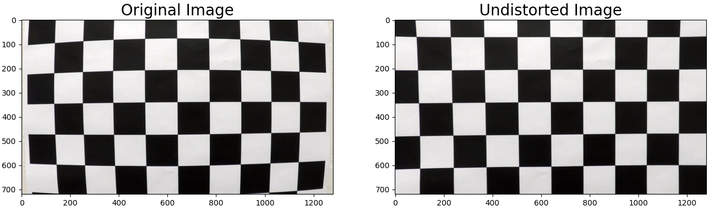
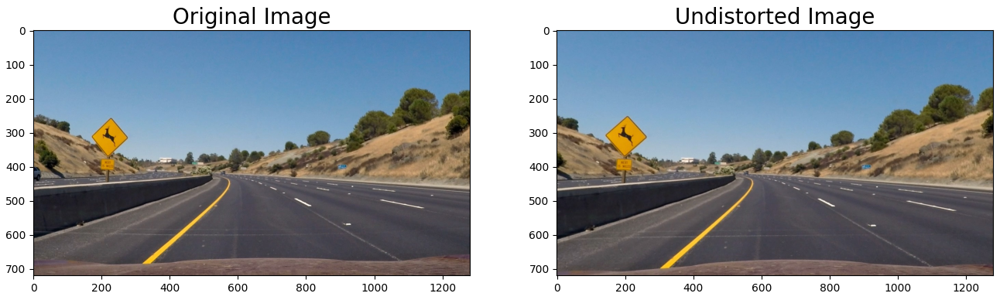
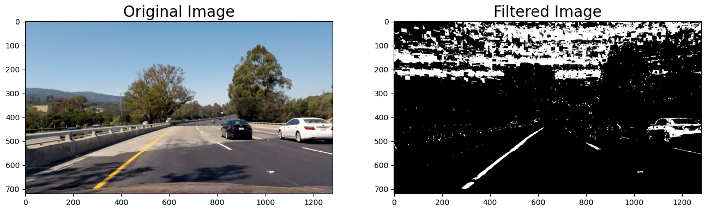
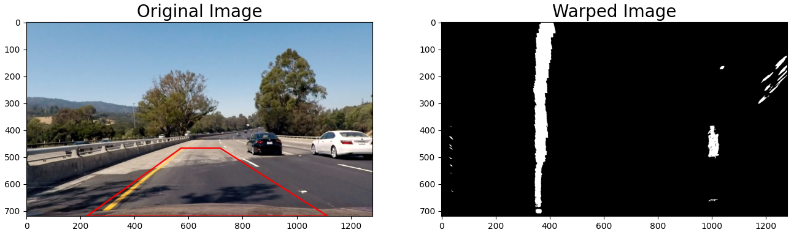
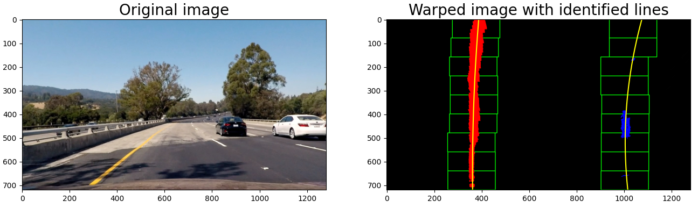
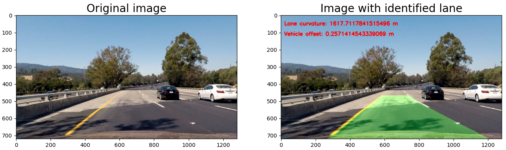

## Writeup

---

**Advanced Lane Finding Project**

The goals / steps of this project are the following:

* Compute the camera calibration matrix and distortion coefficients given a set of chessboard images.
* Apply a distortion correction to raw images.
* Use color transforms, gradients, etc., to create a thresholded binary image.
* Apply a perspective transform to rectify binary image ("birds-eye view").
* Detect lane pixels and fit to find the lane boundary.
* Determine the curvature of the lane and vehicle position with respect to center.
* Warp the detected lane boundaries back onto the original image.
* Output visual display of the lane boundaries and numerical estimation of lane curvature and vehicle position.

## [Rubric](https://review.udacity.com/#!/rubrics/571/view) Points

The implemented code for this project is located in the `Code.py` file. In the following I will go through all the points and describe how this was implemented and I will show processed output images.

### Camera Calibration

#### 1. Briefly state how you computed the camera matrix and distortion coefficients. Provide an example of a distortion corrected calibration image.

The code for this step is contained in the method `calibrate_camera` (lines 105 through 124).

I start by preparing "object points", which will be the (x, y, z) coordinates of the chessboard corners in the world. Here I am assuming the chessboard is fixed on the (x, y) plane at z=0, such that the object points are the same for each calibration image.  Thus, `objp` is just a replicated array of coordinates, and `objpoints` will be appended with a copy of it every time I successfully detect all chessboard corners in a test image.  `imgpoints` will be appended with the (x, y) pixel position of each of the corners in the image plane with each successful chessboard detection.  

Then I used the output `objpoints` and `imgpoints` to compute the camera calibration matrix `mtx` and distortion coefficients `dist` using the `cv2.calibrateCamera()` function.  Afterwards I applied this distortion correction to the test image using the `undistort_image` method (line 161- 164) and obtained this result: 

### Pipeline (single images)

Using the calculated matrix and distortion coefficients, each image from the vehicle camera can be distorted, for example check the following test image:

#### 2. Describe how (and identify where in your code) you used color transforms, gradients or other methods to create a thresholded binary image.  Provide an example of a binary image result.

When the image has been distorted, I used a combination of color and gradient thresholds to generate a binary image (thresholding steps at lines 171 through 218 in `filter_image ` method).  
To apply the gradient thresholds, the Sobel x, Sobel magnitude and the Sobel direction gradients are computed. Additionally, the R and S color channels are extracted and used for the color thresholds. The threshold processing steps are performed to get relevant line information and to reduce the false positives.

Here's an example of my output for this step.  

#### 3. Describe how (and identify where in your code) you performed a perspective transform and provide an example of a transformed image.

The code for my perspective transform includes a function called `warp_image()`, which appears in lines 131 through 156.  The `warp_image()` function takes as inputs an image (`img`) and the parameter `rewarp` which indicates if the image shall be "re-warped" if it has already been transformed. The perspective transformation takes place by transforming source to destination points.  The following source and destination points has been hardcoded and has been chosen by eye-balling:

|  Source   | Destination |
| :-------: | :---------: |
| 223, 720  |   330, 1    |
| 572, 468  |  330, 720   |
| 716, 468  |  950, 720   |
| 1114, 720 |   950, 1    |

I verified that my perspective transform was working as expected by drawing the `src` and `dst` points onto a test image and its warped counterpart to verify that the lines appear parallel in the warped image. 

#### 4. Describe how (and identify where in your code) you identified lane-line pixels and fit their positions with a polynomial?

In the next step it is determined which pixels of the warped image belong to a line. This is performed by implementing a sliding window and fitting the identified pixel positions with a polynomial.
The sliding window algorithm is implemented in the method `start_line_pixel_detection` (line 229 to 292).

As starting point for determining where the lane lines are, the highest peaks of computed histograms are used, and the sliding windows are used to move upwards the lines and identify their route.
The pixels inside the sliding windows are identified are pixels for either the right or the left line.

In the next step the method `approximate_lines` (line 300 to 366) is applied to fit the right and left lines with a 2nd order polynomial (yellow) determined by the previously detected pixels for the right (blue) and left line (red). 

In the next cycle, instead of calculating the sliding windows again, the previous computed polynomials are used to identify the lines of the current frame. 
This is useful because it saves computing time and there is no major change of the lane between to sequential frames (line 394 to 417, method `continue_line_pixel_detection`).

Moreover, before drawing the polynomials a sanity check is performed by using the method `sanity_check` (line 371 to 387). It checks if the identified lines approximated by the polynomials would be parallel to each with regards to a certain tolerance. If the sanity check is not passed, the previous detected lines are drawn and if the check fails in the next cycle again, the pixel detection algorithm is restarted by applying `start_line_pixel_detection` again.

The result of this processing step looks like this:

#### 5. Describe how (and identify where in your code) you calculated the radius of curvature of the lane and the position of the vehicle with respect to center.

I did this in lines 425 through 439 implemented in the method `measure_lane_information`. Here, the curvatures of the right and the left line are calculated using the formulas provided in the lessons. The final curvature of the lane represents the average of line curvatures.
Moreover, the vehicle offset is computed using the lane center and the center of the vehicle.

#### 6. Provide an example image of your result plotted back down onto the road such that the lane area is identified clearly.

I identify the lane with the method `identify_lane`  in lines 446 through 463. At this I re-warp the image using `warp_image()` with the parameter `rewarp` equal to True. 
Here is an example of my result on a test image:

---

### Pipeline (video)

#### 1. Provide a link to your final video output.  Your pipeline should perform reasonably well on the entire project video (wobbly lines are ok but no catastrophic failures that would cause the car to drive off the road!).

Here's a [link to my video result](./project_video_out.mp4)

---

### Discussion

#### 1. Briefly discuss any problems / issues you faced in your implementation of this project.  Where will your pipeline likely fail?  What could you do to make it more robust?

Now I will list additional techniques I used to make the algorithm more stable and efficient:

- Sanity check to verify if the lane is good otherwise drop it and take the last good lane. This additional implementation is useful to remove strong outliers which could lead the vehicle to driving into a wrong direction and maybe causing an accident. The check is performed by checking the right and left line are parallel.
- Switch between using sliding windows and last computed polynomials to detect line pixels. This method enabled to use previous lane information to make the algorithm less time consuming and more efficient. To avoid getting stuck in an early polynomial with which no good new lanes can be detected, the algorithm can be restarted and the pixels are searched from scratch again using sliding windows.
- In order to make the algorithm more robust the good line information of each cycle is stored over multiple frames and is used to smooth the current detection. This is performed in the method `approximate_lines` (line 304 to 351). Here, the mean value of calculated coefficients of line polynomials from the last cycle and the current cycle is calculated.

The pipeline might fail in the following the cases:

- More variations in the brightness of the lines -> More jitter
- White Vehicle on the same lane or in general white vehicles close the lines -> More false positives for line pixels
- Bad weather conditions, like heavy rain, could make the detection more difficult or in general a bad recording quality

The following steps could performed to make the algorithm more robust:

- Optimization of configuration parameters of thresholds and gradient calculations
- Optimize the used sobel operators and color channels to extract as much lane information as possible and to reduce all possible false positives.
- Find a sophisticated method to identify source and destination points for perspective transformation (so far only eye-balling); if this is done, also the sanity check can be performed with less tolerance and less outliers are accepted
- Find the perfect amount of to be averaged line detections